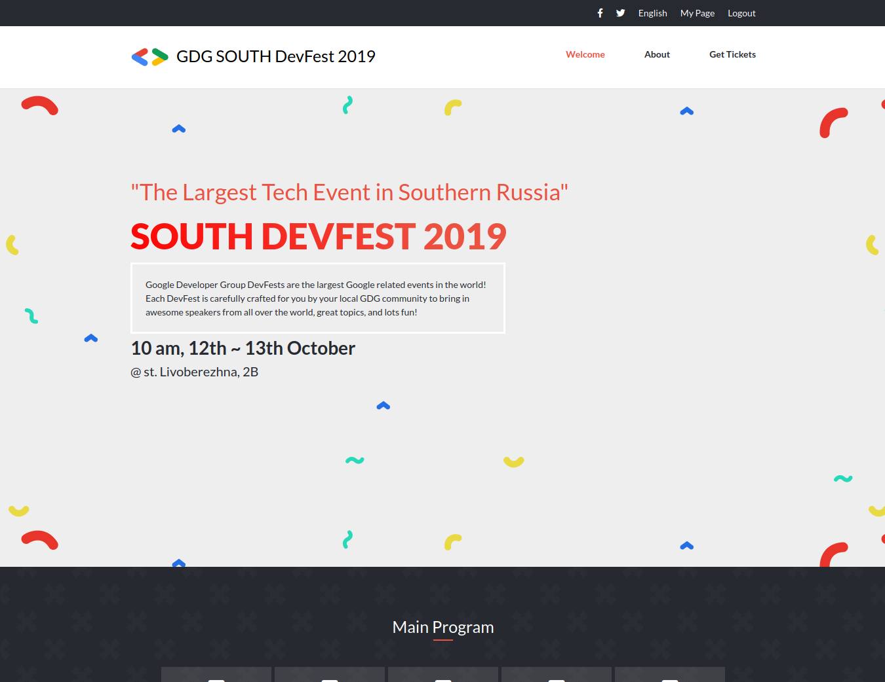
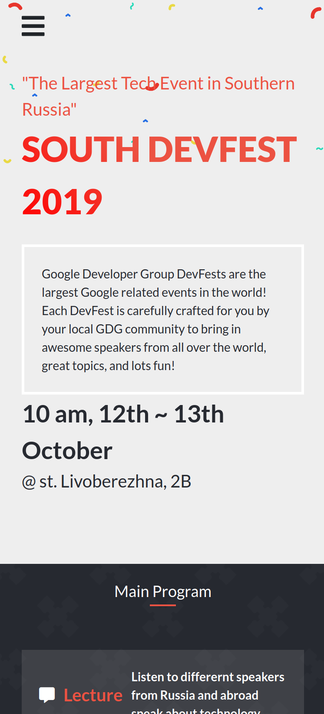
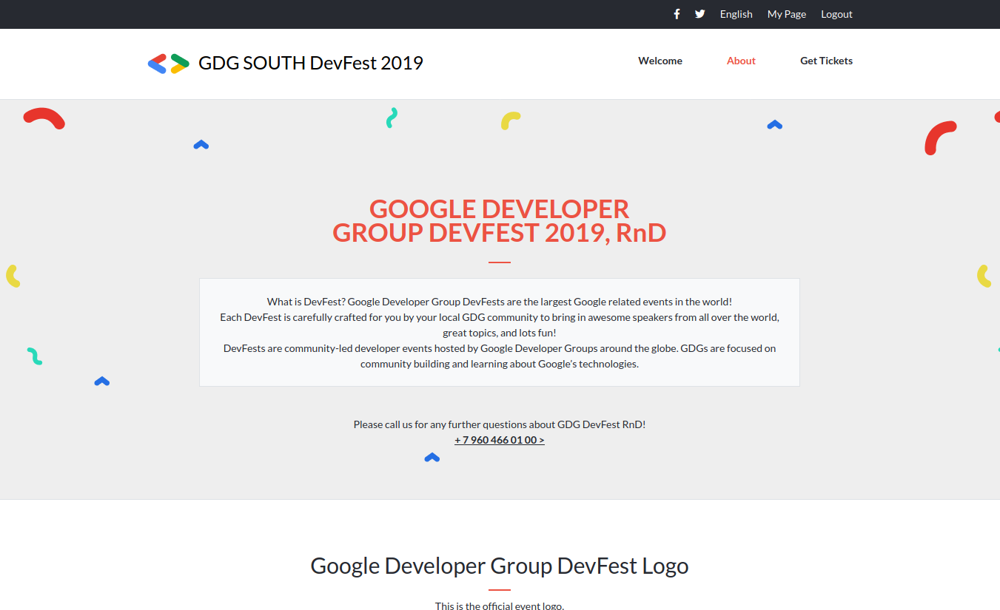
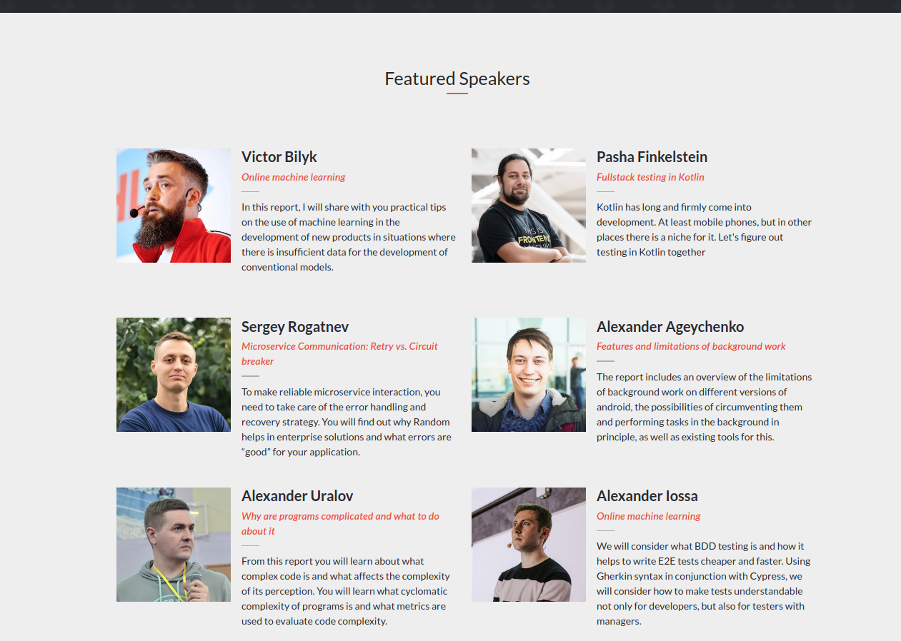

#  Capstone Project - Convention website for Develolper Festival Rostov-On-Don, Russia
I built this project with inspiration from an original webpage [here](https://devfest.gdgrnd.ru/)  using the layout and deisgn style concepts [behance.com](https://www.behance.net/gallery/29845175/CC-Global-Summit-2015). 
GDG RND is an actual community, and the event was an actual event I attended. I am using the content on their website for the Developer Festival of 2019 to implement [this design](https://www.behance.net/gallery/29845175/CC-Global-Summit-2015).
The idea is to create an original Conference website based on the design at [behance.com](https://www.behance.net/gallery/29845175/CC-Global-Summit-2015) 

## Built With

- HTML,
- CSS,
- Bootstrap,
- Font Awesome

### Milestone

- To create an original Conference website based on the design at [behance.com](https://www.behance.net/gallery/29845175/CC-Global-Summit-2015) 

## Live Webpage

[Click Here](https://raw.githack.com/SmithVyne/DevFest-RND/devfest/index.html)

## Author

👤 **Smith Nkereuwem**

- Github: [@SmithVyne](https://github.com/SmithVyne9)
- Twitter: [@SmithVyne](https://github.com/SmithVyne)
- Email: [email me](smithnkereuwem2@gmail.com)

## Show your support

Give a ⭐️ if you like this project!

## Acknowledgments

- This page is inspired by Behance
- Used Google Fonts for the fonts
- Used Fontawesome for the icons
- Used Bootstrap to style a few elements on the webpage. 
- Used images from GDG RND's [webpage](https://devfest.gdgrnd.ru). 
- Design idea by [Cindy Shin in Behance](https://www.behance.net/adagio07)